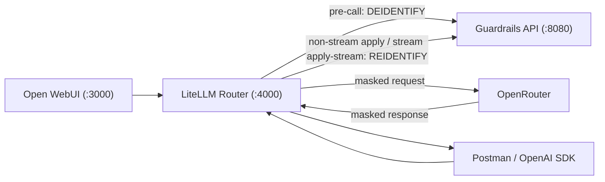

# LiteLLM + OpenRouter + Guardrails PoC

This integration example demonstrates router-mediated PII masking/unmasking with:

- Guardrails service (unmodified CPU image from this repo)
- LiteLLM proxy router
- Open WebUI (pre-configured to use LiteLLM)
- OpenRouter upstream model

The router exposes a standard OpenAI-compatible endpoint:

- `POST /v1/chat/completions`

## Architecture



The router callback is fail-closed:

- If Guardrails is unavailable/times out/returns error, request is aborted.
- Router does not bypass Guardrails on errors.

## Files

- `/Users/oleg/Projects/_antimatter/guardrails/integrations/litellm_openrouter/docker-compose.yml`
- `/Users/oleg/Projects/_antimatter/guardrails/integrations/litellm_openrouter/config.yaml`
- `/Users/oleg/Projects/_antimatter/guardrails/integrations/litellm_openrouter/custom_callbacks/guardrails_callback.py`
- `/Users/oleg/Projects/_antimatter/guardrails/integrations/litellm_openrouter/postman/guardrails-litellm-openrouter.postman_collection.json`
- `/Users/oleg/Projects/_antimatter/guardrails/integrations/litellm_openrouter/postman/guardrails-litellm-openrouter.postman_environment.json`

## Quick Start

1. Create local env file:

```bash
cp integrations/litellm_openrouter/.env.example integrations/litellm_openrouter/.env
```

2. Set secrets in `/Users/oleg/Projects/_antimatter/guardrails/integrations/litellm_openrouter/.env`:

- `OPENROUTER_API_KEY`
- `LITELLM_MASTER_KEY`

3. Start the full harness:

```bash
docker compose -f integrations/litellm_openrouter/docker-compose.yml --env-file integrations/litellm_openrouter/.env up --build
```

4. Wait for readiness:

- Router: `http://localhost:4000/health/readiness`
- Guardrails: `http://localhost:8080/readyz`
- Open WebUI: `http://localhost:3000`

`OPENAI_API_KEY` in Open WebUI is wired automatically from `LITELLM_MASTER_KEY`, so no second token setup is needed.
Open WebUI runs with `OFFLINE_MODE=true` in this compose to avoid background model downloads and keep startup predictable.

## Open WebUI Demo

1. Open `http://localhost:3000`.
2. Start a chat (auth is disabled in this demo compose).
3. Pick model `demo-openrouter`.
4. Send a prompt with PII and ask model to repeat values exactly.
5. Verify response contains original values, while Guardrails logs show masking/unmasking stages.

## Postman Demo

Import:

- Collection: `/Users/oleg/Projects/_antimatter/guardrails/integrations/litellm_openrouter/postman/guardrails-litellm-openrouter.postman_collection.json`
- Environment: `/Users/oleg/Projects/_antimatter/guardrails/integrations/litellm_openrouter/postman/guardrails-litellm-openrouter.postman_environment.json`

Set environment values:

- `router_api_key` = `LITELLM_MASTER_KEY`
- `demo_model` = `demo-openrouter` (default)

Run requests:

1. `Router Health`
2. `Non-stream completion (PII echo demo)`
3. `Streaming completion (PII echo demo)`

Expected behavior:

- Router request includes real PII.
- Upstream OpenRouter receives masked placeholders.
- Response to client contains original (unmasked) values.
- Streaming preserves on-the-fly unmasking, including split placeholders.

## Troubleshooting

- `401 Unauthorized` from router:
  - Ensure `Authorization: Bearer <LITELLM_MASTER_KEY>` is set.
- Router `503`/`500` with guardrails error detail:
  - Verify Guardrails container is healthy on `http://guardrails:8080`.
  - Check `GUARDRAILS_URL`, `GUARDRAILS_TIMEOUT_S` in `.env`.
- OpenRouter upstream errors:
  - Verify `OPENROUTER_API_KEY`.
  - Verify selected `OPENROUTER_MODEL` is available for your key/account.
