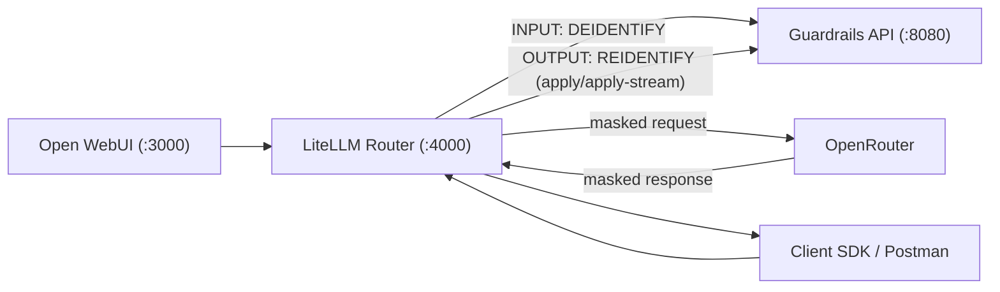

# LiteLLM + OpenRouter + Guardrails PoC

Integration harness for router-mediated masking/re-identification with:
- Guardrails service
- LiteLLM proxy
- OpenRouter upstream
- Open WebUI frontend

Guardrails defaults in this integration are aligned with the current release:
- policy id: `external`
- Nemotron enabled: `GR_ENABLE_NEMOTRON=true`

## Architecture



## Quick Start

```bash
cp integrations/litellm_openrouter/.env.example integrations/litellm_openrouter/.env
```

Set required secrets in `.env`:
- `OPENROUTER_API_KEY`
- `LITELLM_MASTER_KEY`
- `HF_TOKEN` (recommended)

If you are reusing an older `.env`, ensure these compatibility-sensitive values are updated:
- `GUARDRAILS_POLICY_ID=external`
- `GR_ENABLE_NEMOTRON=true`

Start stack:

```bash
docker compose -f integrations/litellm_openrouter/docker-compose.yml --env-file integrations/litellm_openrouter/.env up --build
```

## Main Files

- `integrations/litellm_openrouter/docker-compose.yml`
- `integrations/litellm_openrouter/config.yaml`
- `integrations/litellm_openrouter/custom_callbacks/guardrails_callback.py`
- `integrations/litellm_openrouter/postman/guardrails-litellm-openrouter.postman_collection.json`
- `integrations/litellm_openrouter/postman/guardrails-litellm-openrouter.postman_environment.json`

## Validation Checklist

- Router ready: `http://localhost:4000/health/readiness`
- Guardrails ready: `http://localhost:8080/readyz`
- WebUI available: `http://localhost:3000`
- Callback default policy id resolves to `external`
- Client-facing response contains reidentified values while upstream request remains masked
